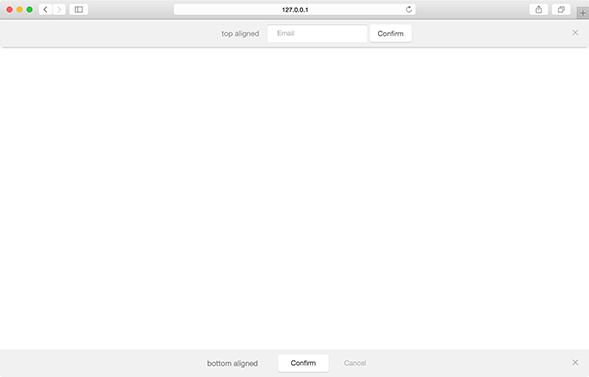
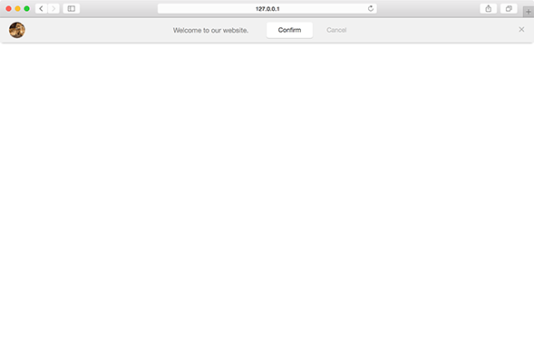
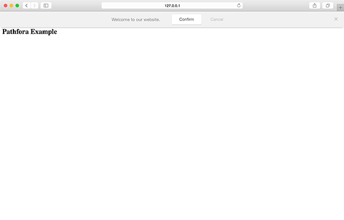

[NEEDS: description]

## position

Positition of the bar module relative to the browser window.

| Value | Type | Behavior |
|---|---|---|
| top | string | `default` module is absolutely positioned to the top of the window |
| top-fixed | string | module sticks to the top of the window when scrolling |
| bottom-fixed | string | module sticks to the bottom of the window when scrolling |

### Positions - [Live Preview](../../examples/preview/layouts/bar/positions.html)

<pre data-src="../../examples/src/layouts/bar/positions.js"></pre>

## variant

Variants determines any extra content that may be used by the module.

| Value | Type | Behavior |
|---|---|---|
| 1 | int | `default` text-only module |
| 2 | int | module includes an image |  

### Image - [Live Preview](../../examples/preview/layouts/bar/image.html)

<pre data-src="../../examples/src/layouts/bar/image.js"></pre>

## pushDown

For `top` or `top-fixed` positioned bars, we can select an element to push down (add a top margin) so it doesn't get covered by the module, this is especially helpful for top-aligned site navigation.

| Value | Type | Behavior |
|---|---|---|
|  | string | selector of the element that should move down with the bar. |

### Image - [Live Preview](../../examples/preview/layouts/bar/pushdown.html)

<pre data-src="../../examples/src/layouts/bar/pushdown.js"></pre>